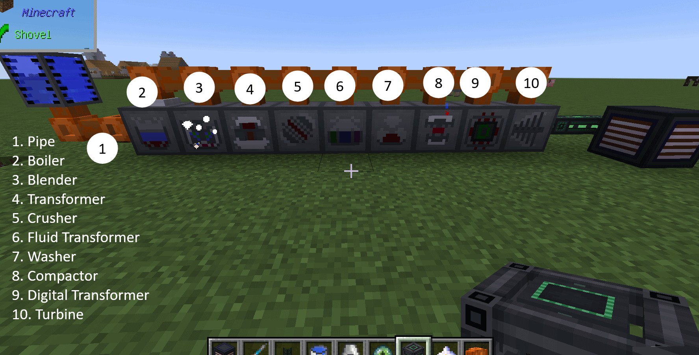

# NuclearCraft Steam Additions
More useful steamy stuff for early and late game.

(`Note`. This mod is in very WIP. Please consider [issue tracker](issues) for posting issues and suggestions.)

Basically this mod was created as replacement for GT as Steam Era implementation in my mod-pack.

This stuff will be useful at the early play before player gets RF machines and late game when you have High-Pressure steam from the NC reactor which opens you some new recipes

### 1. How could i make mod for steam stuff without pipes?
## Machines (processors) implemented:
### 2. Steam boiler 
Add some fuel and water to get steam
### 3. Steam Blender 
Drop some solid items in it. Get liquid from it.
### 4. Steam Transformer 
Transform items (4 items input) into something new with the magic of steam
### 5. Steam Crusher 
Crushes items with the pressure of steam
### 6. Steam Fluid Transformer 
Transforms fluids (3 fluids input) into something new with well known magic of steam
### 7. Steam Washer 
Washes items with steam
### 8. Steam Compactor 
Washes items with steam
### 9. Steam Turbine 
The way you can quit steam era and step into world of forge energy

## Check mod [WIKI pages](wiki)

## Permissions
Feel free to go ahead and use this mod in your pack if you wish!